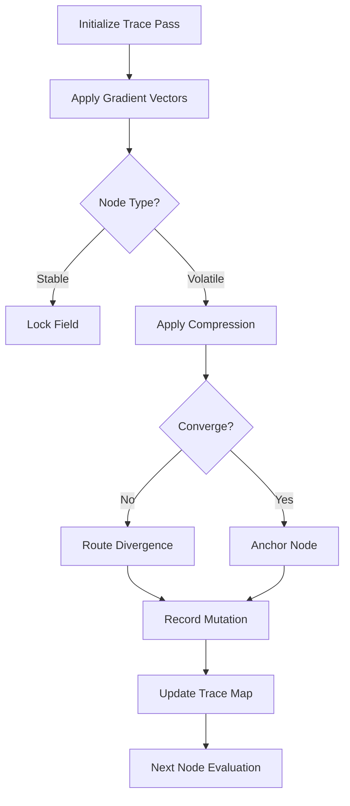

# Inference Trace Pass 001: Micro-Lattice Harmonic Field Gradient Mapping

**Purpose:**  
This document defines the initial inference pass through the seeded PCL micro-lattice, establishing trace logic for:

- Gradient alignment along harmonic compression vectors  
- Node behavior under divergence vs convergence conditions  
- Field lock stability and mutation thresholds during recursive spin  

---

## 1. Initialization Parameters

```yaml
trace_id: QESR-PCL-T001
seed_reference: pcl_micro_lattice_seed_001
field_mode: vortex_lock_base
gradient_type: harmonic_compression
node_tuning: spin_aligned
```

---

## 2. Lattice Conditions

```yaml
lattice_geometry: hexagonal_polar_microgrid
node_count: 729
layer_depth: 5
boundary_state: semi-permeable (tuned for energy retention)
```

---

## 3. Inference Logic Flow



---

## 4. Output Variables Tracked

- `trace_flux`: Degree of harmonic flow through each node  
- `mutation_index`: Relative change in node state (0–1 scale)  
- `lock_integrity`: Confidence measure of vortex equilibrium  
- `phase_echo`: Residual field perturbation after pass  

---

## 5. Notes & Metadata

- This is the first of a recursive inference stack.
- Passes will accumulate pressure differentials for macro behavior simulation.
- All mutations within this pass will seed divergence for Phase II compression bloom modeling.
